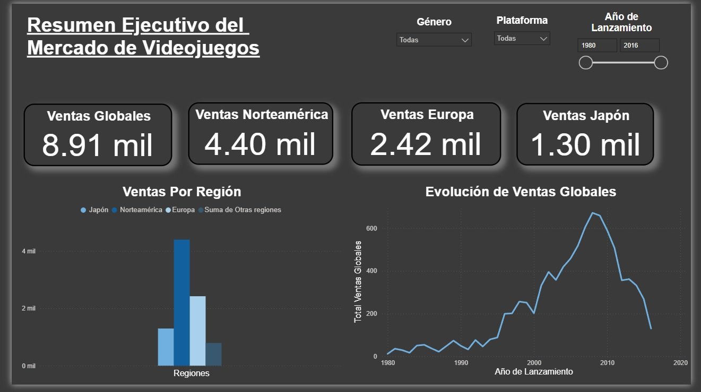
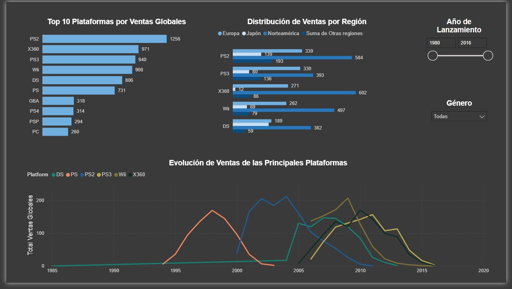
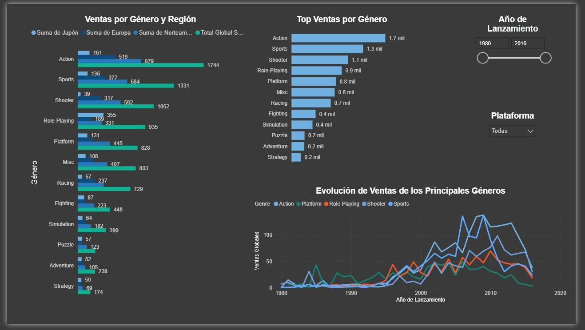

# Video Game Sales Analysis – Ice Online Store

## Descripción
Proyecto de análisis de datos enfocado en identificar patrones que determinan el éxito comercial de los videojuegos.  
El objetivo es apoyar la planeación de campañas publicitarias para 2017 utilizando datos históricos de ventas, plataformas, géneros y reseñas (hasta 2016).

Este proyecto simula un caso real de negocio para una tienda online de videojuegos.

---

## Objetivo del análisis
- Identificar plataformas y géneros con mayor potencial de ventas.
- Analizar diferencias en preferencias por región (Norteamérica, Europa y Japón).
- Evaluar la relación entre reseñas (críticos y usuarios) y ventas.
- Validar hipótesis mediante pruebas estadísticas.

---

## Dataset
El dataset no se incluye en el repositorio.

Para ejecutar el notebook:
1. Descarga el archivo `games.csv` desde una fuente pública compatible.
2. Colócalo dentro de la carpeta `data/` con el nombre `games.csv`.

---

## Herramientas utilizadas
- Python
- pandas
- NumPy
- matplotlib
- SciPy
- Jupyter Notebook
- PowerBI

---

## Metodología
1. **Carga y preparación de datos**
   - Normalización de columnas
   - Conversión de tipos de datos
   - Manejo de valores ausentes (incluyendo `tbd`)
   - Creación de la métrica `total_sales`

2. **Análisis exploratorio**
   - Evolución de lanzamientos por año
   - Ventas por plataforma y ciclo de vida
   - Distribución de ventas y detección de outliers

3. **Análisis por región**
   - Plataformas líderes por región
   - Géneros más rentables
   - Impacto de la clasificación ESRB

4. **Análisis de reseñas**
   - Correlación entre calificaciones y ventas
   - Comparación entre reseñas de críticos y usuarios

5. **Pruebas de hipótesis**
   - Comparación de calificaciones entre plataformas (Xbox One vs PC)
   - Comparación de calificaciones entre géneros (Acción vs Deportes)

---

## Análisis y Dashboards

   
  
   Este dashboard ofrece una visión general del mercado global de videojuegos, mostrando las ventas totales por región y su evolución a lo largo del tiempo.
   Permite identificar rápidamente los principales mercados y tendencias históricas mediante filtros interactivos.

   

   Este dashboard analiza el desempeño de las principales plataformas de videojuegos,
   identificando aquellas con mayor volumen de ventas globales, su distribución por
   región y su evolución a lo largo del tiempo. Se utilizan filtros para profundizar
   en periodos y segmentos específicos.

   
   
   Este dashboard explora el comportamiento de ventas por género, mostrando los géneros
   más relevantes, su distribución regional y su evolución histórica. El análisis
   permite identificar patrones de preferencia del mercado a lo largo del tiempo. 

  
## Principales hallazgos
- **PS4** y **Xbox One** lideran las ventas en el periodo reciente (2013–2016).
- El género **Acción** domina en Norteamérica y Europa, mientras que **Rol** es clave en Japón.
- Las reseñas de **críticos** muestran una correlación positiva moderada con las ventas; las de usuarios no.
- Existen diferencias estadísticamente significativas entre las calificaciones de los géneros Acción y Deportes.

---

## Conclusiones
Los resultados permiten orientar decisiones de marketing para 2017, priorizando plataformas y géneros según el mercado regional.  
El análisis demuestra cómo los datos pueden apoyar decisiones estratégicas en la industria del entretenimiento.

---

## Autor
**Benjamín Moreno**  
Proyecto de portafolio – Análisis de Datos / Ciencia de Datos
